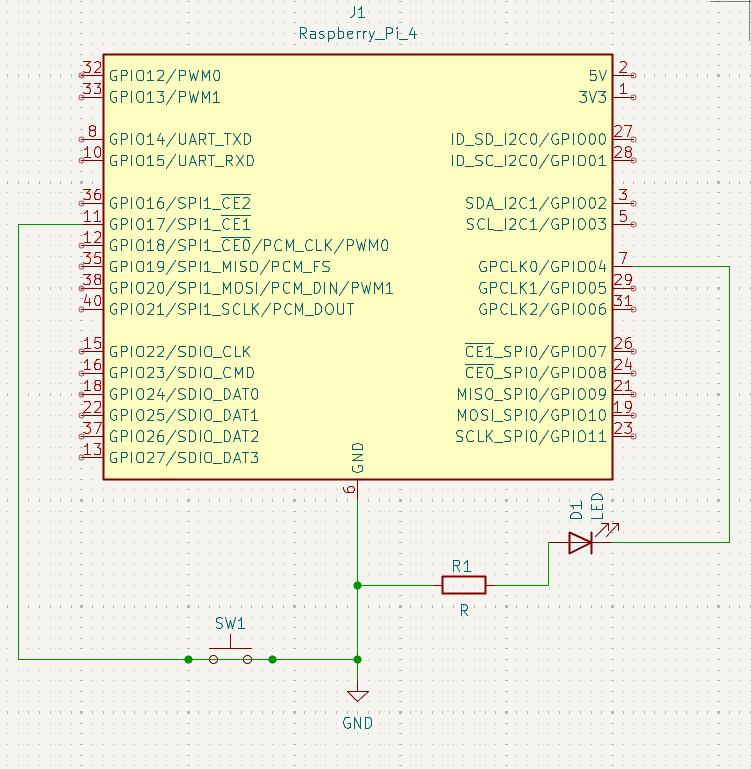

# Electronics Projects

Projects documenting my progress in electronics, embedded systems, and hardware.

## Skills Learned
- Circuit design
- Raspberry Pi GPIO
- LEDs, buttons, resistors
- Breadboarding
- Python hardware control
- Debugging electronics

---

## Blinking LED

Simple GPIO LED blink project.

  

---

## Button Input LED

LED controlled using a push button.

  

### Schematic

  

