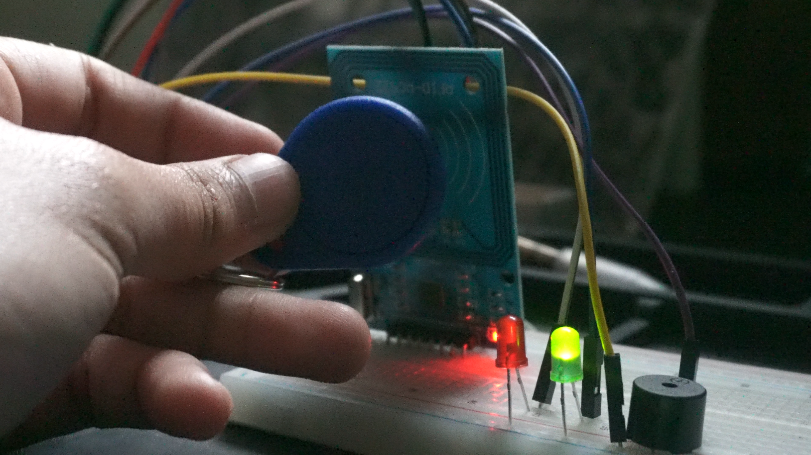

# ⚡ Electronics Portfolio
### Beginner → Advanced Hardware Projects

Hands-on projects focused on electronics, embedded systems, GPIO, and hardware engineering.

---

# 🟢 One of Beginner Project:

## 🔘 Button Input LED

  

### 📐 Schematic

  

---

# 🟡 Novice Projects

## 🔘 RFID

A basic RFID authentication system that reads tag IDs using an RFID reader module and triggers actions (LED/relay) based on authorized credentials.

  

### 📐 Schematic

  

# 🔵 Intermediate (Coming Soon)
---

> Coming soon...

---

# 🛠 Skills Developed

- Circuit fundamentals  
- GPIO input/output control  
- Breadboarding and prototyping  
- Embedded Python programming  
- Sensor and module interfacing  
- Debugging hardware systems  
- Reading and designing schematics  

---

### 🚀 Goal
Building real-world embedded systems that combine hardware, software, and security principles.

